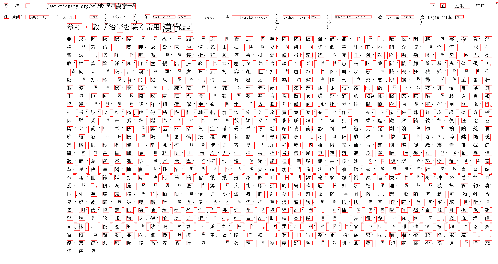
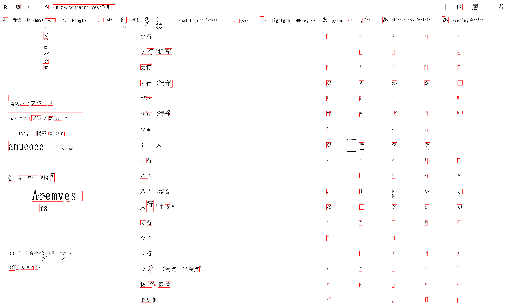
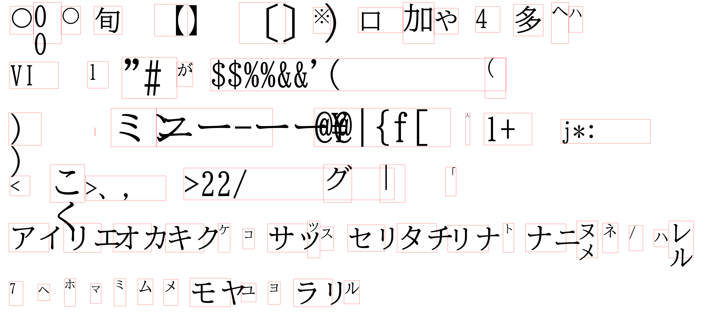

# TesseractTextBoxRecognizer
Tesseract Text Box Reconginizer

This a simple command line client to Google Cloud Vision Text Recognizer. 

<h2> 
1 Install
</h2>
Please download tesseract-ocr engine <b>tesseract-ocr-w64-setup-5.3.0.20221222.exe</b>
and install it. We use Windows11 OS. 
 
https://github.com/UB-Mannheim/tesseract/wiki
 

 
<h2>
2 Install python packages
</h2>
Please clone this repository to your local PC. 
We use Python3 venv on Windows11 OS.
 
>pip install requirements.txt
</h2>

<h2>
3 Sample Program
</h2>
Please open Windows Powershell console, and run the following command in the console window. 

> python TesseractTextBoxRecognizer.py

 
This TesseractTextBoxRecognizer.py script reads the recognition.conf file. 
<pre>
[parameter]
images_dir = "./samples"
output_dir = "./outputs"
image_format= ".png"

language_hints   = "ja"

[preprocessor]
preprocessing    = True
gray_image       = True
image_scaling    = 3
constrast        = 2
sharpness        = 3

[visualizer]
font_name        = "BIZ-UDMinchoM.ttc"

</pre>

Please note that we specify the language_hints in this config file to be "ja" to recognize Japanese text. 
You have to change this language_hints property depending on your text language. 

Example 1: 参考・教育漢字を除く常用漢字.png 
 
 

Text Box Recognition: 

 

Example 2: 付録常用漢字の一覧_付表 
 
 

Text Box Recognition: 

 

Example 3: 半角カタカナ一覧 
 
 

Text Box Recognition: 

 

Example 4: VSCodeScreenShot 
 
 

Text Box Recognition: 

 

Example 5: Symbols_Kakana 
 
 

Text Box Recognition: 

 

